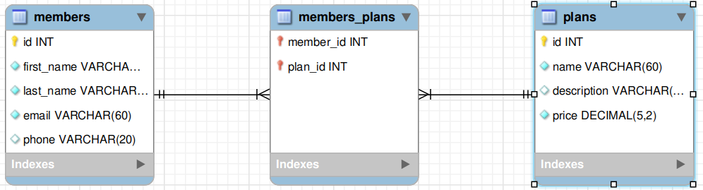
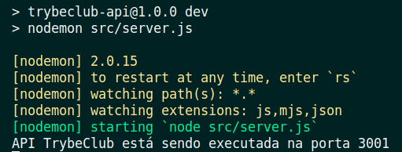
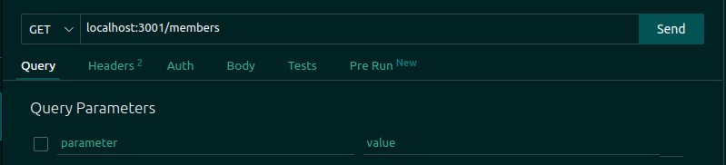
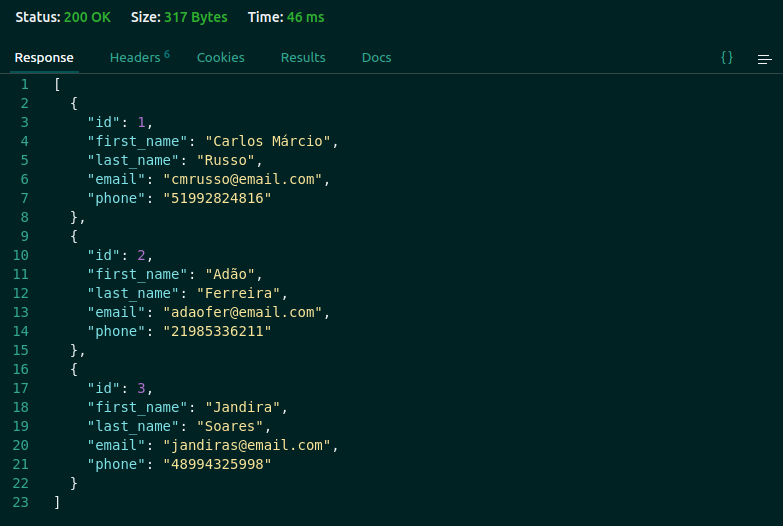
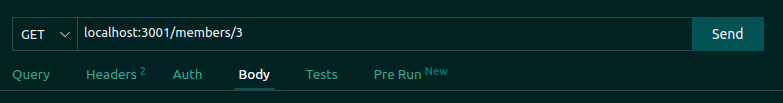
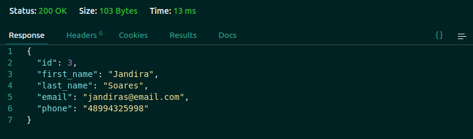

# Testando uma API Rest com Express e MySQL

<details>

<summary><h1>Introdução</h1></summary>

<details>
 
 <summary><h2>O que vamos aprender?</h2></summary>

Chegou a hora de você aprender a realizar testes em uma API REST integrada a um banco de dados MySQL. Então, hoje é dia de colocar mais alguns instrumentos em nossa caixa de ferramentas! 🧰
 
</details>
 
<details>

<summary><h2>Você será capaz de:</h2></summary>

- Criar códigos para aplicações Node.js utilizando o princípio de Desenvolvimento Guiado por Testes (*Test Driven Development*); 
- Realizar testes de integração em uma API que utiliza um banco de dados MySQL;
- Programar funções stubs (dublês) em seus testes;

</details>
 
<details>
 
<summary><h2>Porque isso é importante?</h2></summary>

Testes de integração são fundamentais para garantir a qualidade de uma aplicação, especialmente quando se trata de uma API conectada a um banco de dados. Eles permitem validar se a comunicação entre a API e o banco de dados MySQL está funcionando como esperado, antes da produção aplicação para os usuários finais.

Outra motivação é a garantia de que futuras alterações no código não afetem o funcionamento da API. Com testes de integração, podemos implementar novas funcionalidades em nossa aplicação ou em sua comunicação com o banco de dados sem causar problemas. Ou seja, podemos ficar sossegados ao promover atualizações em nossa aplicação.😌

Então, bora lá! Esta é uma ótima oportunidade para você se familiarizar mais ainda com o conceito de *Desenvolvimento Guiado a Testes*, o **TDD** (do inglês *Test-Driven Development*). Com o TDD, você escreve testes da funcionalidade antes de sua implementação no código, ajudando a garantir que os requisitos do projeto estejam sendo atendidos.

Também, estaremos aproveitando para apresentar para você: **Mocha**, **Sinon**, **Chai** e **Chai HTTP**. Quatro excelentes aliados que vão permitir que você escreva seus testes de integração em uma API REST integrada ao MySQL. 

Vamos nessa? 🦸‍♀️🦸‍♀️🦸‍♀️🦸‍♀️

</details>

</details>

# Conteúdos

## Testes de integração vs Testes unitários

Imagine que você está cozinhando uma refeição. Os **testes unitários** são como *experimentar individualmente cada ingrediente*, verificando se estão bons e se atendem aos padrões de qualidade. Por exemplo:
- se a manteiga está derretida, 
- se o sal está ajustado ao gosto, 
- se a quantidade de açúcar é suficiente, 
- se a massa do bolo cresceu, 
- etc.

Já os **testes de integração** são como misturar todos os ingredientes e cozinhá-los juntos para verificar se eles produzem a refeição deliciosa. Você verificaria se todos os ingredientes *se integram corretamente* e se o resultado final:
- é um bolo
- e se ele está gostoso.

No nosso contexto de API Web, os **testes unitários** verificam como cada parte, como cada componente da aplicação funciona isoladamente, se funciona como esperado. 
Enquanto os **testes de integração** verificam se todos os componentes conseguem trabalhar juntos para entregar a funcionalidade esperada. *(com aquele sabor inigualável 😋😋😋)*

## Testes de Integração

Quando estamos escrevendo códigos, costumamos fazer pequenos testes manuais para verificar trechos de código. Nosso aliado maior aliado é o o `console.log()` no terminal, que vai nos guiando como uma lanterna iluminando a caverna escura que são os códigos. 

Esta é uma prática muito saudável e bastante recomendada, tanto em nosso ambiente de aprendizado como enquanto pessoas desenvolvedoras. Não iremos abandonar essa pŕatica jamais! Os testes de integração vêm ao encontro de nossas boas práticas de teste já consolidadas. Você estará escrevendo asserções que garantem que todas as funcionalidades estão em constante sintonia. 📻

>***Anota ai***🖊️: "Testes de integração verificam a comunicação adequada entre componentes do sistema. Ao contrário dos testes unitários, que testam unidades isoladas, os testes de integração juntam todas as unidades para verificar se elas funcionam corretamente em conjunto."

## Testes de Integração em API REST + MYSQL

O que faremos em nossos testes de integracão, no contexto de nossa API REST integrada a um banco de dados MySQL, é partir do recebimento de requisição e seguir até o envio da respota adequada.

Ocorre que, no meio do caminho, está a comunicação com nosso banco de dados. Esta é uma funcionalidade intermediária de nossa aplicação. "Não desconfiaremos" do funcionamento do banco de dados nesta situação de testes de integração. Mas sim, estaremos apenas validando requisições e respostas da API. O nosso banco de dados será representado por ***dublês*** que vão simular o funcionamento esperado do database, retirando  da jogada eventuais problemas de comunicação.

Assim, fica possível focar nossa validação apenas na resposta integrada de nossa API. Este é um ponto de vista global da aplicação, que não se preocupa com os resultados intermediários de nossas requisições, apenas com o resultado final.

Enfim, vamos dar uma olhada em nossas novas ferramentas e instrumentos? 🪛⛏️🛠️🪓


## Mocha, Chai, Chai HTTP e Sinon

### Mocha

A página da [documentação do Mocha](https://mochajs.org/) decreve este framework da seguinte maneira:

*"Mocha é um framework(estrutura) de teste JavaScript rica em recursos que é executada no Node.js e no navegador, tornando o teste assíncrono simples e divertido. 😜 Os testes do Mocha são executados em série, permitindo relatórios flexíveis e precisos, enquanto mapeia exceções não capturadas para os casos de teste corretos."*

### Chai e Chai HTTP

[Chai](https://www.chaijs.com/) é uma biblioteca de asserções que vai ser pareada com o Mocha para nos proporcionar maior poder e um estilo mais legível na escrita dos testes. Além de nos permitir utilizar seu plugin, o `Chai HTTP`

Já o [Chai HTTP](https://www.chaijs.com/plugins/chai-http/) é um plugin que vai permitir que, juntamente com o Mocha e o Chai, possamos simular uma requisição a nossa API. E a melhor parte é não precisar inicializar a API manualmente! 

Logo mais, você vai trabalhar com eles no desenvolvimento da aplicação do TrybeClub, um clube de vantagens exclusivo para pessoas estudantes da Trybe. 😎

### Sinon

Tudo certo. Será que já podemos começar a codar?
- Já sabemos desenvolver APIs REST integradas a bancos de dados, com Node.js, Express e Node MySQL 2. 
- Já temos um framework de testes (Mocha) e uma biblioteca de asserções(Chai) que consegue simular uma requisição a nossa API REST (com a utilização do plugin Chai HTTP pelo Chai). 

O que falta agora? 

> Só falta uma maneira de não dependermos de um banco de dados em funcionamento para realizarmos nossos testes.

Aqui entra em cena nosso último instrumento nesta composição: o ***Sinon***. 

Este pacote nos permite simular as interações de nossa API REST com nosso banco de dados na forma de dublês (*stubs*), funções que irâo *imitar*, *dublar* as funções que fazem a comunicação entre API REST e MySQL.

Chegou a hora de alongar os dedos e partir para o código! 🖥️

## API REST do TrybeClub

Como você já aprendeu nos conteúdos anteriores o que é necessário para estruturar um projeto de API REST integrado ao MySQL, vamos utilizar o repositório do [**TrybeClub**](https://github.com/desafiopraticotrybe/trybe-club) como pontapé inicial. 

O TrybeClub é um clube de vantagens exclusivo para estudantes da Trybe, com benefícios mensais exclusivos para as pessoas estudantes que fazem parte deste clube **maaaravilhoso**.

> Para trabalhar neste projeto, você deve fazer um **Fork** do repositório do TrybeClub para sua máquina. A branch **main** está com tudo preparado para você começar os estudos. Já a branch **gabarito** tem tudo que será desenvolvido hoje já implementado. Se não lembra como funciona, search like a dev, ou [clique aqui](https://docs.github.com/pt/github-ae@latest/get-started/quickstart/fork-a-repo#bifurcar-um-reposit%C3%B3rio)

O projeto já vem pronto ser executado dentro de um container Docker, então você não precisa se preocupar com a instalação das dependências e de seu versionamento. Tudo isto será feito através do **Docker**, com a *receita de bolo* do **docker compose**. Isto garante que você está criando um projeto flexível, de fácil compartilhamento e que se comportará da mesma maneira independentemente de qual máquina esteja rodando ele! 
Tudo isso graças ao nosso grande amigo Docker: é ou não é totalmente excelente?

> Antes de qualquer coisa, vale a pena você dedicar um tempinho para dar uma bisbilhotada nos arquivos iniciais do projeto.

Na raiz do projeto encontramos os seguintes arquivos:

No arquivo **`package.json`**, você encontrará todas dependências que já vem instaladas no TrybeClub, além dos scripts que já vêm prontos para usar:

- `npm start`: executa o arquivo `server.js` com o node.
- `npm run dev:` executa o arquivo `server.js` com o nodemon.

> Nodemon é o ***melhor amigo*** da pessoa desenvolvedora. Diferentemente do Node, o Nodemon reinicia a aplicação sempre que alterações são feitas em seus arquivos. Uma mão na roda, não é?

- `npm test`: executa os arquivos de teste.

No arquivo **`Dockerfile`**, você encontrará a configuração de inicialização da API. 

> Se precisar, tire um tempinho para rever os conceitos já aprendidos no [Dia 02: Manipulando Imagens no Docker](https://app.betrybe.com/learn/course/5e938f69-6e32-43b3-9685-c936530fd326/module/94d0e996-1827-4fbc-bc24-c99fb592925b/section/5987fa2d-0d04-45b2-9d91-1c2ffce09862/day/da25fd46-8818-4234-8603-a442b047370f/lesson/670cdc27-f578-4733-907e-87652c46c002).

No arquivo **`docker-compose.yaml`**, temos dois ambientes configurados para rodar nossa aplicação. 

- O container nomeado como ``trybeclub_api`` é um serviço que constrói um ambiente baseado na imagem do node, na versão 16, e que expoẽ a porta 3000 do computador. 

- Já o container ``trybeclub_db`` é o serviço do nosso database, que roda com a imagem do Servidor MySQL na versão 8.0.29 e está vinculando 
  - uma porta do seu computador local (a porta 33060) 
  - a uma porta dentro do container (a porta 3306).
  - É importante salientar que a seção ``environment`` define o valor de duas variáveis dentro do container:

    - `MYSQL_ROOT_PASSWORD`: define a senha do usuário *root* do MySQL, que será utilizada para acessar o banco de dados.
    - `MYSQL_DATABASE`: especifica o nome do banco de dados a ser criado no início do MySQL, caso ele ainda não exista.

> Você pode tirar um tempinho para rever este conteúdo do [Dia 03: Orquestrando Containers com Docker Compose](https://app.betrybe.com/learn/course/5e938f69-6e32-43b3-9685-c936530fd326/module/94d0e996-1827-4fbc-bc24-c99fb592925b/section/5987fa2d-0d04-45b2-9d91-1c2ffce09862/day/2f1a5c4d-74b1-488a-8d9b-408682c93724/lesson/170b7b6e-925c-40e8-9d0a-08e41f599ec5)

No arquivo **`trybeclub_script.sql`** você encontrará o script que é utilizado para criar e popular as tabelas do banco de dados sempre que o container do database for levantado. 

> O Diagrama Entidade Relacionamento (DER) das tabelas do banco de dados e seus relacionamentos correspondentes é mostrado na figura abaixo. 

Tire um tempo também para dar uma olhadinha no script do TrybeClub e no Diagrama Entidade Relacionamento abaixo.

> <p align='center'></p>

Já na pasta **`src`** contamos com a configuração inicial de nossa API REST. 

O arquivo **`connection.js`** (```./src/database```) utiliza a biblioteca `mysql2` para criar a conexão com o servidor MySQL. Para reduzir o tempo gasto conectando e desconectando com o servidor, utilizaremos o `createPool()`, melhorando a latência entre nossas queries ao manter a conexão sempre aberta e disponível para nossa API.

O arquivo **`app.js`** contém a configuração inicial de nossa API. Aqui, criamos nosso app como uma aplicação Express e *"dizemos"* para que o app *use* o método `express.json()`, um middleware que será necessário para analisar e lidar com requisições **JSON**.

O arquivo **`server.js`** dá o *start* em nossa aplicação através do método `app.listen()`. O primeiro parâmetro é a porta que nossa aplicação está escutando e o segundo é uma função que será executada, no nosso caso, um ```console.log``` que imprime a mensagem `API TrybeClub está sendo executada na porta 3001`

Ufa, que bom que tudo está configurado e prontinho para o desenvolvimento de sua aplicação!

Bora codar??? 

## Escrevendo seu primeiro teste!

Agora, o momento é ideal para aplicarmos a técnica de TDD (Test-Driven Development) ou Desenvolvimento Guiado por Testes. Primeiramente, você escreverá testes para uma determinada funcionalidade de nossa aplicação para então partir para o desenvolvimento de tal funcionalidade. Você repetirá o ciclo até que tenha todas funcionalidades de nossa aplicação devidamente testadas e implementadas.


> ***De olho na dica!*** 👀 : quanto mais você exercitar a prática de desenvolvimento de software utilizando TDD, mais suas habilidades serão aprimoradas, aumentando suas chances de alcançar sucesso no mercado de trabalho.


Já temos as dependências necessárias para que você possa escrever os **testes de integração**. Vamos instalar elas com `npm install`.

``` bash
npm install
```

Caso fosse necessário, você poderia instalar ```mocha```, ```chai```, ```sinon``` e ```chai-http``` nas dependências de desenvolvimento com o seguinte comando:

``` bash
npm i mocha@10.0.0 chai@4.3.6 sinon@14.0.0 chai-http@4.3.0 -D
```

O próximo passo é escrever nosso primeiro teste, validando se é possível listar as pessoas membros do TrybeClub. Um endpoint para a lista completa e outro para a listagem por id.

Escreva seus testes no arquivo `members.test.js` (***src/tests/integration/members.test.js)***. 

Começaremos escrevendo o stub para nosso teste:

``` javascript
// src/tests/integration/doubles/members.stub.js

const membersList = [
  {
    id: 1,
    first_name: 'Carlos Márcio',
    last_name: 'Russo',
    email: 'cmrusso@email.com',
    phone: '51992824816',
  },
  {
    id: 2,
    first_name: 'Adão',
    last_name: 'Ferreira',
    email: 'adaofer@email.com',
    phone: '21985336211',
  },
  {
    id: 3,
    first_name: 'Jandira',
    last_name: 'Soares',
    email: 'jandiras@email.com',
    phone: '48994325998',
  },
];

module.exports = { membersList };

```

Faremos dois testes:

- um para a listagem de todas pessoas membro do TrybeClub, através de uma requisição ao endpoint ***GET /members***;

- outro para validar a busca por uma pessoa membro pelo id, através de uma requisição ao endpoint ***GET /members/:id***.

``` javascript
//  tests/integration/members.test.js

// Importamos o Chai para poder utilizar suas asserções nos testes
const chai = require('chai');
// Importamos o plugin Chai HTTP para que possamos simular as interações com nossa API REST;
const chaiHttp = require('chai-http');

const { expect, use } = chai;
// Aqui fazemos a ligação do Chai HTTP com o Chai;
use(chaiHttp);
// Importamos o Sinon que nos permitirá utilizar nossos dublês para simular as interações com o database;
const Sinon = require('sinon');
const app = require('../../src/app');
// Importamos nosso connection para que sua função 'connection.execute' posse ser dublada pelo Sinon;
const connection = require('../../src/database/connection');
// Este é nosso dublê da lista de membros;
const { membersList } = require('./doubles/members.stub');

describe('Testando o endpoint GET /members', () => {
  // O hook afterEach irá executar Sinon.restore para restaurar os stubs após cada teste.
    afterEach(Sinon.restore);
  it('Testando a listagem de pessoas membros do TrybeClub', async () => {
    // Fazemos que a chamada do método execute seja dublada pelo membersList quando for chamada dentro deste teste;
    Sinon.stub(connection, 'execute').resolves([membersList]);
    // Utilizamos o chai para simular a requisição a nosso app, o que desencadeia na chamada de connection.execute, que está dublada como memberList
    const response = await chai.request(app).get('/members');
    // Esperamos que a requisição tenha status 200 nesta situação e que a lista de membros seja retornada no corpo da requisição;
    expect(response.status).to.equal(200);
    expect(response.body).to.deep.equal(membersList);
  });
    // Observe que repetimos o mesmo processo, apenas mudando a função dos stubs;
  it('Testando a listagem da pessoa membro do TrybeClub pelo id', async () => {
    Sinon.stub(connection, 'execute').resolves([[membersList[0]]]);

    const response = await chai.request(app).get('/members/1');
    
    expect(response.status).to.equal(200);
    expect(response.body).to.deep.equal(membersList[0]);
  });
});
```

Nos testes acima, nós:

- utilizamos o **Sinon** para dublar o retorno de `connection.execute()`, que terá um retorno em particular para cada endpoint:

  - a lista de membros quando o endpoint for ***GET /members***;

  - o membro de id 1 quando o endpoit for ***GET /members/:id***;
  
- utilizamos o hook `afterEach` para executar `Sinon.restore`, restaurando as funções dubladas após cada teste. 

- constante `response` tem a resposta de nossa requisição para os endpoints, simulada através do Chai/Chai-HTPP.

- utilizamos as asserções do Chai para validar a `response` de cada endpoint.

Agora precisamos levantar nossa composição de containers do Docker:

``` bash
docker-compose up -d
```
Pronto, podemos relizar nosso primeiro teste com o script npm test, certo?

``` bash
npm test
```

Ih! Deu ruim, nossos testes falharam... 

Mas é claro, como estamos trabalhando em TDD (Desenvolvimento Orientado a Testes), primeiramente escrevemos nossos testes para então implementarmos as funcionalidades em questão! Ou seja, agora vamos desenvolver as funcionalidades da nossa API! 

## Criando o endpoint de listagem de membros do TrybeClub

Agora que você já tem o cenário restringido pelos testes que acabou de escrever, o ambiente está seguro para codar.

Vamos começar escrevendo as funções que se comunicam com o database no arquivo `members.database.js` (`src/database`) .

``` javascript
// src/database/members.database.js

const connection = require('./connection');

const listMembers = () => connection.execute('SELECT * FROM members');
// Note que a query de listMembersById está utilizando '?' como um placeholder do id, que é determinado no array que passamos como segundo argumento de connection.execute()
const listMembersById = (id) => connection.execute('SELECT * FROM members WHERE id = ?', [id]);

module.exports = {
  listMembers,
  listMembersById,
};
```

Agora vamos escrever a estrutura de nossas rotas no arquivo `members.routes.js`(`src/routes`).

``` javascript
// src/routes/members.routes.js

const express = require('express');

const router = express.Router();

const membersDB = require('../database/members.database');

router.get('/', async (_req, res) => {
  try {
    // o try executa nossa funcionalidade para o caso de sucesso da requisição
    const [result] = await membersDB.listMembers();
    res.status(200).json(result);
  } catch (err) {
    // caso algo dê errado com a query, o catch captura o erro (err) e responde com status 500 e com a mensagem do erro
    console.log(err);
    res.status(500).json({ message: err.sqlMessage });
  }
});

router.get('/:id', async (req, res) => {
  try {
    // já aqui, o try também executa nossa funcionalidade para quando dá tudo certo
    const { id } = req.params;
    const [[result]] = await membersDB.listMembersById(id);
    if (result) {
      res.status(200).json(result);
    } else {
      // mas também tem uma resposta adequada para quando não é encontrado um membro com o id solicitado pelo endpoint
      res.status(404).json({ message: 'Pessoa membro não encontrada' });
    }
  } catch (err) {
    // caso algo dê errado com a query, o catch captura o erro (err) e responde com status 500 e com a mensagem do erro
    console.log(err);
    res.status(500).json({ message: err.sqlMessage });
  }
});

module.exports = router;

```
Note que utilizamos a sintaxe `try/catch` para lidar com os erros que podem acontecer em nossa comunicação com o banco de dados, e que lidamos também com a solicitação de um id inválido, que não representa nenhum membro do TrybeClub. 

Também, estamos fazendo uso da syntaxe `async/await` quando executamos as funções `listMembers()` e `listMembersById()`. Como estamos nos comunicando com o banco de dados, 
há uma certa latência entre o momento do pedido e o momento de sua entrega. Você receberia uma promessa ao executar estas funções sem a sintaxe do `async/await`.

Agora sim! Vamos testar?

``` bash
npm test
```

Pronto! Os testes estão passando!😏

Agora vamos simular algumas requisições para sua API e ver tudo isso acontecendo na telinha. Você pode utilizar o [ThunderClient](https://marketplace.visualstudio.com/items?itemName=rangav.vscode-thunder-client), o [Insomnia](https://insomnia.rest/download), ou qualquer outro programa *API Client*.

> Primeiramente, precisamos de nossa aplicação em pé.

```bash
npm run dev
```
<p align='center'></p>

> Agora, faça o envio de uma requisição ao endpoint ***GET /members*** (*note que a API TrybeClub está sendo executada na porta 3001 de seu computador*):

<p align='center'></p>

> A API responde com status 200 e com a lista de pessoas membro do TrybeClub, que veio de um banco de dados MySQL!

<p align='center'></p>

> Agora faça o envio de uma requisição ao endpoint ***GET /members/3***:

<p align='center'></p>

> E a resposta tem status 200 e a pessoa membro do TrybeClub de id 3!

<p align='center'></p>

> Se você estiver com vontade de ver sua aplicação "fora do caminho do sucesso", solicite o endpoint ***GET /members/33*** e ver o que acontece:

<p align='center'></p>

> A resposta possui o *status 404* (*Not Found*) e um objeto com a mensagem *"Pessoa não encontrada"*

Você terminou de implementar dois endpoints capazes de buscar por pessoas cadastradas no banco de dados do TrybeClub! Parabéns 😎

Logo mais tem a Aula ao Vivo, então dê uma relaxada e volte depois para continuarmos a implementar as demais funcionalidades!

# Vamos praticar!

Vamos continuar implementando as demais rotas do TrybeClub. O administrador do TrybeClub precisa de um endpoint que retorne o faturamento mensal do clube de benefícios.

### Exercícios

1 - Crie os testes de integração para o endpoint ***GET /members/admin*** retornando o faturamento mensal. 

> O faturamento mensal é a soma do pagamento mensal de cada pessoa membro do TrybeClub.

- A API deve ter uma resposta com status 200 e JSON conforme ao exemplo a seguir:
``` json
{
  "monthly_revenue": "89.70"
}
```

2 - Implemente o endpoint GET ***/members/admin*** retornando o faturamento mensal.

- A API deve ter uma resposta conforme ao exemplo do exercício anterior.

3 - Crie os testes de integração para o endpoint ***POST /members***, no qual será possível adicionar um novo membro ao TrybeClub

- Você precisa que o corpo da requisição (`req.body`) contenha um JSON com um formato conforme ao seguinte:

``` json
{
  "first_name": "Glauco",
  "last_name": "Neves",
  "email": "glauconeves@email.com",
  "phone": "21998743568",
  "plan_id": "3"
}
```

- Você também precisa a resposta da API tenha status 201 e um objeto JSON conforme ao seguinte:

``` json
{
  "member_id": "4",
  "first_name": "Glauco",
  "last_name": "Neves",
  "email": "glauconeves@email.com",
  "phone": "21998743568",
  "plan_id": "3"
}
```

4 - Implemente a funcionalidade do endpoint ***POST /members***, no qual seja possível adicionar um novo membro ao TrybeClub

- Você precisa que o corpo da requisição (`req.body`) contenha um JSON conforme ao exemplo do exercício anterior.

- Você também precisa a resposta da API tenha status 201 e um objeto JSON, conforme ao exemplo do exercício anterior.

5 - Crie os testes de integração para o endpoint ***DELETE /members/:id***, no qual seja possível deletar um membro do TrybeClub, a resposta deve possuir o status 204.

6 - Implemente a funcionalidade do endpoint ***DELETE /members/:id*** para que seja possível deletar um membro do TrybeClub, a resposta deve possuir o status 204.

7 - Crie os testes de integração para o endpoint ***PUT /members/:id***, no qual seja possível atualizar os dados de um membro do TrybeClub pelo seu id.

- Você precisa que o corpo da requisição (`req.body`) contenha um JSON com um formato conforme ao seguinte:

``` json
{
  "first_name": "Jandira",
  "last_name": "da Silva Junqueira Soares",
  "email": "jandirasjs@email.com",
  "phone": "48994325999",
  "plan_id": "1"
}
```

- Você também precisa que a resposta a esta requisição retorne um objeto JSON em um formato conforme ao seguinte:

``` json
{
  "message": "Cadastro atualizado com sucesso",
  "update":{
    "first_name": "Jandira",
    "last_name": "da Silva Junqueira Soares",
    "email": "jandirasjs@email.com",
    "phone": "48994325999",
    "plan_id": "1"
  }
}
```

8 -  Implemente a funcionalidade do endpoint ***PUT /members/:id***, no qual seja possível atualizar os dados de um membro do TrybeClub pelo seu id.

- Você precisa que o corpo da requisição (`req.body`) contenha um JSON conforme ao exemplo do exercício anterior..

- Você também precisa que a resposta a esta requisição retorne um objeto JSON conforme ao exercício anterior.

### Exercícios Bônus

9 - Crie os testes de integração da requisição do endpoint ***GET /members/admin*** para que valide o acesso somente para o administrador do TrybeClub:

- O administrador do TrybeClub precisa que este endpoint seja acessível apenas com seu login, que precisa estar no corpo da requisição no seguinte formato:

``` json
{
    "user": "admin",
  "password": "xablau"
}

```

- Você deve criar middlewares de validação para os seguintes casos:

  - Quando a chave `"user"` não estiver definida no corpo da requisição, a resposta deve ter status 400 e um JSON como o seguinte:

``` json
{
  "message": "user não informado."
}
```

  - Quando a chave `"user"` for diferente de `"admin"`, a resposta deve ter status 401 e um JSON como o seguinte:

``` json
{
  "message": "user inválido."
}
```

  - Quando a chave `"password"` não estiver definida no corpo da requisição, a resposta deve ter status 400 e um JSON como o seguinte:

``` json
{
  "message": "password não informado."
}
```

  - Quando a chave `"password"` for diferente de `"xablau"`, a resposta deve ter status 401 e um JSON como o seguinte:

``` json
{
  "message": "password inválido."
}
```

- Trabalhando em TDD, você pode começar criando casos de teste para cada um dos casos acima.

Dicas:

- o middleware deve ser uma função callback que anteceda a função callback criada para o endpoint ***GET /members/admin***.

- Quando houver algo errado, cada middleware deve retornar uma resposta com status e JSON adequados,

- quando estiver tudo certo, cada middleware deve chamar `next()` e passar para o próximo middleware da rota.

10 - Implemente as validações do login do administrador do TrybeClub, conforme aos requisitos e dicas do exercício anterior.

## Gabarito

### Exercícios

1 - Crie os testes de integração para o endpoint ***GET /members/admin*** retornando o faturamento mensal. 

> O faturamento mensal é a soma do pagamento mensal de cada pessoa membro do TrybeClub.

- A API deve ter uma resposta com status 200 e JSON conforme ao exemplo a seguir:
``` json
{
  "monthly_revenue": "89.70"
}
```

#### Solução


- Comece escrevendo um stub para seu teste:

``` javascript
// src/tests/integration/doubles/members.stub.js

/* ... */

const monthlyRevenue = {
  monthlyRevenue: '89.70',
};

module.exports = {
//  membersList,
  monthlyRevenue,
};
```

- Agora, você pode escrever o teste do endpoint ***GET /members/admin***:

``` javascript
//  src/tests/integration/people.test.js

/* ... */

const { /* membersList, */ monthlyRevenue } = require('./doubles/members.stub');

/* ... */

describe('1 - Testando o endpoint POST /members/admin', () => {
  it('Testando o endpoint do faturamento mensal do TrybeClub', async () => {
    // A query entrega um objeto dentro de um array que também está dentro de um array [[{}]]
         Sinon.stub(connection, 'execute').resolves([[monthlyRevenue]]); 

         const response = await chai.request(app).get('/members/admin');

         expect(response.status).to.equal(200);
         expect(response.body).to.deep.equal(monthlyRevenue);
  });
  afterEach(Sinon.restore);
});
```

2 - Implemente o endpoint GET ***/members/admin*** retornando o faturamento mensal.

- A API deve ter uma resposta conforme ao exemplo do exercício anterior.

#### Solução

- No arquivo `src/database/members.database.js`, escreva a função `mothlyRevenue()`, que utiliza o método `connection.execute` para executar uma query no banco de dados do TrybeClub:

Dica: se achar necessário, você pode abrir uma conexão com o banco de dados através do [instalando uma interface gráfica como o Workbench](https://app.betrybe.com/learn/course/5e938f69-6e32-43b3-9685-c936530fd326/module/94d0e996-1827-4fbc-bc24-c99fb592925b/section/fa69c314-da3c-46e0-bcdb-43297772a43e/day/89e3203d-18e4-4329-9c8d-a3f40f2e4248/lesson/4c92bf82-4e5e-49dd-b8c9-4695c79ca33e) para escrever esta query em *"baby steps"*, obtendo uma qury parecida com o exemplo a seguir:

```sql
SELECT 
    SUM(p.price) AS monthlyRevenue
FROM
    trybeclub_db.plans AS p
        INNER JOIN
    trybeclub_db.members_plans AS mp ON p.id = mp.member_id;
```

Com a query em mãos, escreva a função que execute esta query no banco de dados e retorne seu resultado.

``` javascript
// src/database/members.database.js

const connection = require('./connection');

/* ... */

const monthlyRevenue = () => connection.execute(`
SELECT 
SUM(p.price) AS monthlyRevenue 
FROM 
trybeclub_db.plans AS p 
    INNER JOIN
trybeclub_db.members_plans AS mp 
    ON 
p.id = mp.member_id;
`);

module.exports = {
//  listMembers,
//  listMembersById,
  monthlyRevenue,
};
``` 

- Agora voce pode implementar uma rota para este endpoint em `src/routes/members.routes.js`. 

> Note que o endpoint ***GET /admin*** deve vir antes do endpoint ***GET /:id***, para que não haja confusão entre eles

``` javascript
// src/routes/members.routes.js

/* ... */

// router.get('/', async (_req, res) => {
/* ... */
// });

router.get('/admin', async (req, res) => {
  try {
    const [[result]] = await membersDB.monthlyRevenue();
    const { monthlyRevenue } = result;
    res.status(200).json({ monthlyRevenue });
  } catch (err) {
    console.log(err);
    res.status(500).json({ message: err.sqlMessage });
  }
});

// router.get('/:id', async (req, res) => {
/* ... */
// });

module.exports = router;

```

3 - Crie os testes de integração para o endpoint ***POST /members***, no qual será possível adicionar um novo membro ao TrybeClub

- Você precisa que o corpo da requisição (`req.body`) contenha um JSON com um formato conforme ao seguinte:

``` json
{
  "first_name": "Glauco",
  "last_name": "Neves",
  "email": "glauconeves@email.com",
  "phone": "21998743568",
  "plan_id": "3"
}
```

- Você também precisa a resposta da API tenha status 201 e um objeto JSON conforme ao seguinte:

``` json
{
  "member_id": "4",
  "first_name": "Glauco",
  "last_name": "Neves",
  "email": "glauconeves@email.com",
  "phone": "21998743568",
  "plan_id": "3"
}
```

#### Solução

- Comece criando o mock de um novo membro em `src/tests/integration/doubles/members.mock.js`:

``` javascript
// src/tests/integration/doubles/members.mock.js

const newMember = {
  first_name: 'Glauco',
  last_name: 'Neves',
  email: 'glauconeves@email.com',
  phone: '21998743568',
  plan_id: '3',
};

module.exports = {
  newMember,
};

```

- Agora, escreva os testes, esperando que sejam feitas duas chamadas de `connection.execute`, uma para inserir uma nova entidade na tabela `members` e outra para inserir uma nova entidade em `members_plans`:

``` javascript
// src/tests/integration/members/test/js

const { newMember } = require('./doubles/members.mock');

/* ... */ 

  describe('Testando o endpoint POST /members', () => {
    it('Testando a criação de um novo membro do TrybeClub', async () => {
      // Estamos utilizando um recurso do Sinon que permite dublar de maneiras diferentes a chamada de uma mesma função, pois precisamos utilizar connection.execute duas vezes neste caso
      Sinon.stub(connection, 'execute')
      .onFirstCall()
      .resolves([{ insertId: 4 }])
      .onSecondCall()
      // este é um retorno que demonstra que houve 1 linha da tabela afetada durante a execução do insert na tabela de 'members_plans'
      .resolves([{ affectedRows: 1 }]);

      const response = await chai.request(app).post('/members').send(newMember);

      expect(response.status).to.equal(201);
      expect(response.body).to.deep.equal({ ...newMember, id: 4 });
    }); 
    afterEach(Sinon.restore);
});
```
4 - Implemente a funcionalidade do endpoint ***POST /members***, no qual seja possível adicionar um novo membro ao TrybeClub

- Você precisa que o corpo da requisição (`req.body`) contenha um JSON conforme ao exemplo do exercício anterior.

- Você também precisa a resposta da API tenha status 201 e um objeto JSON, conforme ao exemplo do exercício anterior.


#### Solução

- Comece criando a função `createMember` em `src/database/members.database.js`:

``` javascript
// src/database/members.database.js

/* ... */ 

const createMember = async (newMember) => {
  const { firstName, lastName, email, phone, planId } = newMember;
  // Você fará duas inserções no banco de dados, primeiro na tabela 'members' e, com o 'insertId' retornado pelo db, inserir uma nova entidade na tabela 'members_plans'.
  const [{ insertId }] = await connection.execute(`
  INSERT 
  INTO 
  trybeclub_db.members 
  (first_name, last_name, email, phone) 
  VALUES 
  (?, ?, ?, ?);
`, [firstName, lastName, email, phone]);

  const [{ affectedRows }] = await connection.execute(`
  INSERT INTO trybeclub_db.members_plans (member_id, plan_id) VALUES (?, ?);
  `, [insertId, planId]);

  // o retorno das "linhas afetadas" serve apenas para atestar que houve inserção em members_plans, este valor não serve para nossa regra de negócio em si
  return { id: insertId, affectedRows };
};

module.exports = {
//  listMembers,
//  listMembersById,
//  monthlyRevenue,
  createMember,
};
```

- Agora, implemente o endpoint ***POST /*** em `src/routes/members.routes.js`

  - Note que vamos utilizar dois módulos bastante uteis, o [camelize](https://www.npmjs.com/package/camelize) e o [snakeize](https://www.npmjs.com/package/snakeize), que já vem nas dependências do TrybeClub.
  - O camelize transforma recursivamente strings de chave de camel case em estilo snake case. ou seja, o objeto é reformatado de snake_case para camelCase.
  - Já o snakeize, transforma recursivamente strings de chave de snake case em estilo camel case. ou seja, o objeto é reformatado de camelCase para snake_case.

``` javascript
// src/router/members.routes.js

/* ... */

// estes módulos já vem no package.json deste projeto e estão prontos para uso
const camelize = require('camelize');
const snakeize = require('snakeize');

router.post('/', async (req, res) => {
  try {
    // o camelize troca a formatação de um objeto com chaves escritas em snake_case para camelCase
    const { firstName, lastName, email, phone, planId } = camelize(req.body);
    const { id } = await membersDB.createMember({ firstName, lastName, email, phone, planId });
    // já o snakeize troca a formatação de um objeto com chaves em camelCase para snake_case
    const response = snakeize({ id, firstName, lastName, email, phone, planId });
    res.status(201).json(response);
  } catch (err) {
    console.log(err);
    res.status(500).json({ message: err.sqlMessage });
  }
});

module.exports = router;

```

5 - Crie os testes de integração para o endpoint ***DELETE /members/:id***, no qual seja possível deletar um membro do TrybeClub, a resposta deve possuir o status 204.

#### Solução

```javascript
// src/tests/integration/members.test.js

/* ... */

describe('5 - Testando o endpoint DELETE /members ', () => {
  it('Testando deletar um membro do TrybeClub', async () => {
    Sinon.stub(connection, 'execute')
    // este é um retorno que demonstra que houve 1 linha da tabela afetada durante a execução do delete na tabela de 'members_plans'
    .resolves([{ affectedRows: 1 }]);

    const response = await chai.request(app).delete('/members/1').send();

    expect(response.status).to.equal(204);
  }); 
  afterEach(Sinon.restore);
});
```

6 - Implemente a funcionalidade do endpoint ***DELETE /members/:id*** para que seja possível deletar um membro do TrybeClub, a resposta deve possuir o status 204.

#### Solução

- Comece criando a função `deleteMember` em `src/database/members.database.js`:

``` javascript
// src/database/members.database.js

/* ... */

const deleteMember = async (memberId) => {
  await connection
  .execute('DELETE FROM trybeclub_db.members_plans WHERE member_id = ?;', [memberId]);
  const [{ affectedRows }] = await connection
  .execute('DELETE FROM trybeclub_db.members WHERE id = ?', [memberId]);
  // Estamos retornando a quantidade de linhas afetadas pelo delete
  return affectedRows;
};

module.exports = {
//  listMembers,
//  listMembersById,
//  monthlyRevenue,
//  createMember,
  deleteMember,
};

```

- Agora você vai implementar o endpoint ***DELETE /:id*** em `src/routes/members.routes.js`

``` javascript
// src/routes/members.routes.js

/* ... */

router.delete('/:id', async (req, res) => {
  try {
    const { id } = req.params;
    const affectedRows = await membersDB.deleteMember(id);
    // Estamos verificando se conseguimos deletar alguma entidade da tabela "members_plan"
    if (!affectedRows) {
      return res.status(404).json({ message: 'Pessoa membro não encontrada' });
    }
    res.status(204).send();
  } catch (err) {
    console.log(err);
    res.status(500).json({ message: err.sqlMessage });
  }
});

```

7 - Crie os testes de integração para o endpoint ***PUT /members/:id***, no qual seja possível atualizar os dados de um membro do TrybeClub pelo seu id.

- Você precisa que o corpo da requisição (`req.body`) contenha um JSON com um formato conforme ao seguinte:

``` json
{
  "first_name": "Jandira",
  "last_name": "da Silva Junqueira Soares",
  "email": "jandirasjs@email.com",
  "phone": "48994325999",
  "plan_id": "1"
}
```

- Você também precisa que a resposta a esta requisição retorne um objeto JSON em um formato conforme ao seguinte:

``` json
{
  "message": "Cadastro atualizado com sucesso",
  "update":{
    "first_name": "Jandira",
    "last_name": "da Silva Junqueira Soares",
    "email": "jandirasjs@email.com",
    "phone": "48994325999",
    "plan_id": "1"
  }
}
```

#### Solução

- Primeiramente, você precisa criar o mock para este caso de atualização do cadastro:

``` javascript
// src/tests/integration/doubles/members.mock.js

/* ... */

const snakeize = require('snakeize');

/* ... */

const updateMember = {
  first_name: 'Jandira',
  last_name: 'da Silva Junqueira Soares',
  email: 'jandirasjs@email.com',
  phone: '48994325999',
  plan_id: '1',
};

// estamos criando este stub pois esperamos que camelize/snakeize sejam utilizados no "meio do caminho"
const updateMemberResponse = snakeize(updateMember);

module.exports = {
//  newMember,
  updateMember,
  updateMemberResponse,
};

```

- Agora você pode escrever os testes da atualização do cadastro de um membro do TrybeClub:

``` javascript
// src/tests/integration/members/test/js

/* ... */ 

const { 
//  newMember, 
  updateMemberResponse,
  updateMember, 
} = require('./doubles/members.mock');

/* ... */

describe('Testando o endpoint de PUT /members', () => {
  it('Testando atualizar o cadastro de um membro do TrybeClub', async () => {
    // estamos dublando o método 'connection.execute' para que ele retorne tanto a quantidade de linhas afetadas com o membro atualizado
    Sinon.stub(connection, 'execute').resolves([
      { changedRows: 1, updateMemberResponse },
    ]);

    const response = await chai
      .request(app)
      .put('/members/3')
      .send(updateMember);
      
    expect(response.status).to.equal(200);
    expect(response.body).to.deep.equal({
      message: 'Cadastro atualizado com sucesso',
      update: { ...updateMember, id: '3' },
    });
  });
  afterEach(Sinon.restore);
});

```

8 -  Implemente a funcionalidade do endpoint ***PUT /members/:id***, no qual seja possível atualizar os dados de um membro do TrybeClub pelo seu id.

- Você precisa que o corpo da requisição (`req.body`) contenha um JSON conforme ao exemplo do exercício anterior..

- Você também precisa que a resposta a esta requisição retorne um objeto JSON conforme ao exercício anterior.

#### Solução

- Comece criando a função `updateMember` em `src/database/members.database.js`:

```javascript
// src/database/members.database.js

/* ... */

const updateMember = async (memberUp) => {
  const { firstName, lastName, email, phone, id, planId } = memberUp;

  await connection.execute(`
  UPDATE trybeclub_db.members 
  SET first_name = ?, last_name = ?, email = ?, phone = ? 
  WHERE id = ?;`,
   [firstName, lastName, email, phone, id]);

   // Changed rows é o valor de linhas mudadas ao update
   const [{ changedRows }] = await connection
   .execute('UPDATE trybeclub_db.members_plans SET plan_id = ? WHERE member_id = ?;', 
   [planId, id]);
   // retornamos changedRows e o objeto update com os dados atualizados
   return { changedRows, update: { firstName, lastName, email, phone, planId, id } };
};

module.exports = {
//  listMembers,
//  listMembersById,
//  monthlyRevenue,
//  createMember,
//  deleteMember,
  updateMember,
};

```

- Agora você vai implementar o endpoint ***PUT /:id*** em `src/routes/members.routes.js`

``` javascript
// src/routes/members.routes.js

/* ... */

router.put('/:id', async (req, res) => {
  try {
  const { id } = req.params;
  const member = camelize(req.body);
  const { changedRows, update } = await membersDB.updateMember({ ...member, id });
  if (!changedRows) {
    return res.status(200).json({ message: 'Pessoa membro já estava com todos dados atualizados' });
  }
  res.status(200).json({ message: 'Cadastro atualizado com sucesso', update: snakeize(update) });
  } catch (err) {
    console.log(err);
    res.status(500).json({ message: err.sqlMessage });
  }
});
```
### Exercícios Bônus

9 - Crie os testes de integração da requisição do endpoint ***GET /members/admin*** para que valide o acesso somente para o administrador do TrybeClub:

- O administrador do TrybeClub precisa que este endpoint seja acessível apenas com seu login, que precisa estar no corpo da requisição no seguinte formato:

``` json
{
    "user": "admin",
  "password": "xablau"
}

```

- Você deve criar middlewares de validação para os seguintes casos:

  - Quando a chave `"user"` não estiver definida no corpo da requisição, a resposta deve ter status 400 e um JSON como o seguinte:

``` json
{
  "message": "user não informado."
}
```

  - Quando a chave `"user"` for diferente de `"admin"`, a resposta deve ter status 401 e um JSON como o seguinte:

``` json
{
  "message": "user inválido."
}
```

  - Quando a chave `"password"` não estiver definida no corpo da requisição, a resposta deve ter status 400 e um JSON como o seguinte:

``` json
{
  "message": "password não informado."
}
```

  - Quando a chave `"password"` for diferente de `"xablau"`, a resposta deve ter status 401 e um JSON como o seguinte:

``` json
{
  "message": "password inválido."
}
```

- Trabalhando em TDD, você pode começar criando casos de teste para cada um dos casos acima.

Dicas:

- o middleware deve ser uma função callback que anteceda a função callback criada para o endpoint ***GET /members/admin***.

- Quando houver algo errado, cada middleware deve retornar uma resposta com status e JSON adequados,

- quando estiver tudo certo, cada middleware deve chamar `next()` e passar para o próximo middleware da rota.

#### Solução

- Crie os mocks necessários para os testes em `src/tests/integration/doubles/members.mock.js`:

```javascript
// src/tests/integration/doubles/members.mock.js

/* ... */ 

const adminMock = {
  user: 'admin',
  password: 'xablau',
};

const wrongUserAdminMock = {
  user: 'batatinha123',
  password: 'xablau',
}; 

const wrongPasswordAdminMock = {
  user: 'admin',
  password: 'batatinha123',
}; 

module.exports = {
//  newMember, 
//  updateMemberResponse,
//  updateMember, 
  adminMock,
  wrongUserAdminMock,
  wrongPasswordAdminMock,
};
```

- Agora, escreva os testes para cada uma das validações a serem feitas:

```javascript
// src/tests/integration/members.test.js

/* ... */

// describe('Testando o endpoint de POST /members/admin ', () => {
  // it('Testando o endpoint do faturamento mensal do TrybeClub', async () => {

  /* ... */

  // });
  it('Testando quando o user não for informado', async () => {
    Sinon.stub(connection, 'execute').resolves([[monthlyRevenue]]);

    const response = await chai.request(app).get('/members/admin').send({ password: 'xablau' });

    expect(response.status).to.equal(400);
    expect(response.body).to.deep.equal({ message: 'user não informado.' });
  }); 
  it('Testando quando o user for inválido', async () => {
    Sinon.stub(connection, 'execute').resolves([[monthlyRevenue]]);

    const response = await chai.request(app).get('/members/admin').send(wrongUserAdminMock);

    expect(response.status).to.equal(401);
    expect(response.body).to.deep.equal({ message: 'user inválido.' });
  }); 
    it('Testando quando o password não for informado', async () => {
    Sinon.stub(connection, 'execute').resolves([[monthlyRevenue]]);

    const response = await chai.request(app).get('/members/admin').send({ user: 'admin' });

    expect(response.status).to.equal(400);
    expect(response.body).to.deep.equal({ message: 'password não informado.' });
  }); 
  it('Testando quando o password for inválido', async () => {
    Sinon.stub(connection, 'execute').resolves([[monthlyRevenue]]);

    const response = await chai.request(app).get('/members/admin').send(wrongPasswordAdminMock);

    expect(response.status).to.equal(401);
    expect(response.body).to.deep.equal({ message: 'password inválido.' });
  }); 
  // afterEach(Sinon.restore);
// });
```

Finalmente, para que o teste realizado no exercício 1 esteja de acordo com a nova regra, você precisa alterar a requisição feita através do Chai

``` javascript
// src/tests/integration/members.test.js

/* ... */

const { 
//  newMember, 
//  updateMemberResponse,
//  updateMember,
//  wrongUserAdminMock, 
//  wrongPasswordAdminMock, 
  adminMock,
} = require('./doubles/members.mock');

/* ... */


// describe('1 - Testando o endpoint POST /members/admin', () => {
  it('Testando o endpoint do faturamento mensal do TrybeClub com o login de admin', async () => {
//     // A query entrega um objeto dentro de um array que também está dentro de um array [[{}]]
//     Sinon.stub(connection, 'execute').resolves([[monthlyRevenue]]);
 
    const response = await chai.request(app).get('/members/admin').send(adminMock);

//     expect(response.status).to.equal(200);
//     expect(response.body).to.deep.equal(monthlyRevenue);
//   });
//   afterEach(Sinon.restore);
});

```

10 - Implemente as validações do login do administrador do TrybeClub, conforme aos requisitos e dicas do exercício anterior:

#### Solução

Escreva as funções `validateLoginUser` e `validateLoginPassword` no arquivo `adminValidations.js` em `src/middlewares/adminValidations.js`.

``` javascript
// src/middlewares/adminValidations.js

const validateLoginUser = (req, res, next) => {
  const { user } = req.body;
  if (!user) return res.status(400).json({ message: 'user não informado.' });
  if (user !== 'admin') return res.status(401).json({ message: 'user inválido.' });
  next();
};

const validateLoginPassword = (req, res, next) => {
  const { password } = req.body;
  if (!password) return res.status(400).json({ message: 'password não informado.' });
  if (password !== 'xablau') return res.status(401).json({ message: 'password inválido.' });
  next();
};

module.exports = {
  validateLoginUser,
  validateLoginPassword,
};

```

- Altere `src/routes/members.routes.js` para adicionar os middlewares criados no endpoint ***GET /members/admin***:

``` javascript
// src/routes/members.routes.js

/* ... */

const { validateLoginUser, validateLoginPassword } = require('../middlewares/adminValidations');

/* ... */

router.get('/admin', validateLoginUser, validateLoginPassword, async (req, res) => {
//  try {
//    const [[result]] = await membersDB.monthlyRevenue();
//    const { monthlyRevenue } = result;
//    res.status(200).json({ monthlyRevenue });
//  } catch (err) {
//    console.log(err);
//    res.status(500).json({ message: err.sqlMessage });
//  }
});

```

# Recursos Adicionais

- [HTTP Status](https://www.httpstatus.com.br/) - Este site é que referencia todos os códigos de status HTTP com suas definições e exemplos de código em algumas linguagens/frameworks.

- [Express - Escrevendo um middleware](https://expressjs.com/pt-br/guide/writing-middleware.html) - Uma seção da documentação do Express onde temos uma visão geral do desenvolvimento de middlewares no Express.

- [Testando API REST com Mocha e Chai](https://medium.com/@rafaelvicio/testando-api-rest-com-mocha-e-chai-bf3764ac2797) - Um guia básico para escrever rotas e testar uma API REST com Mocha e Chai.
